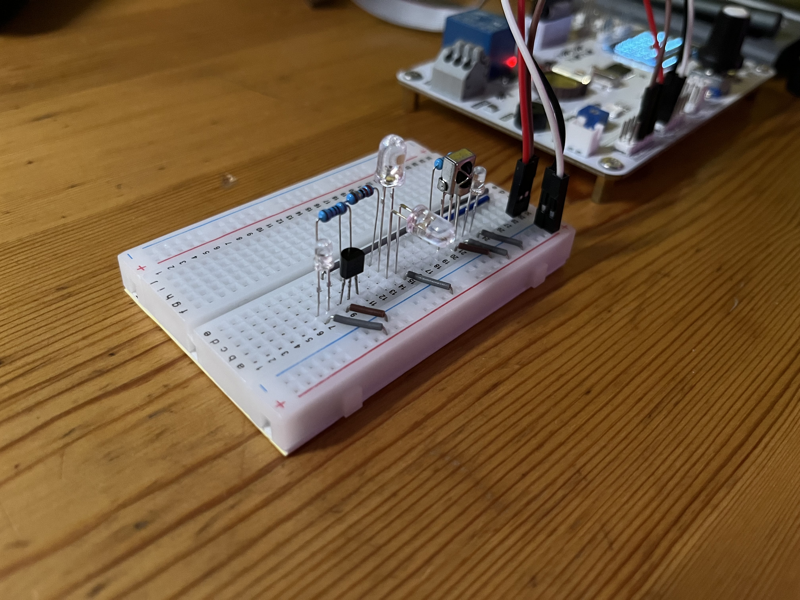
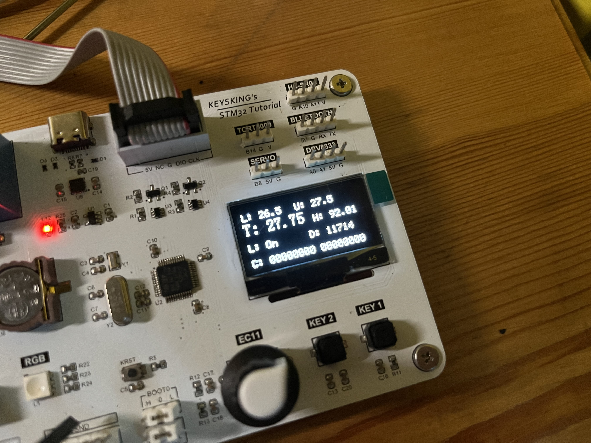
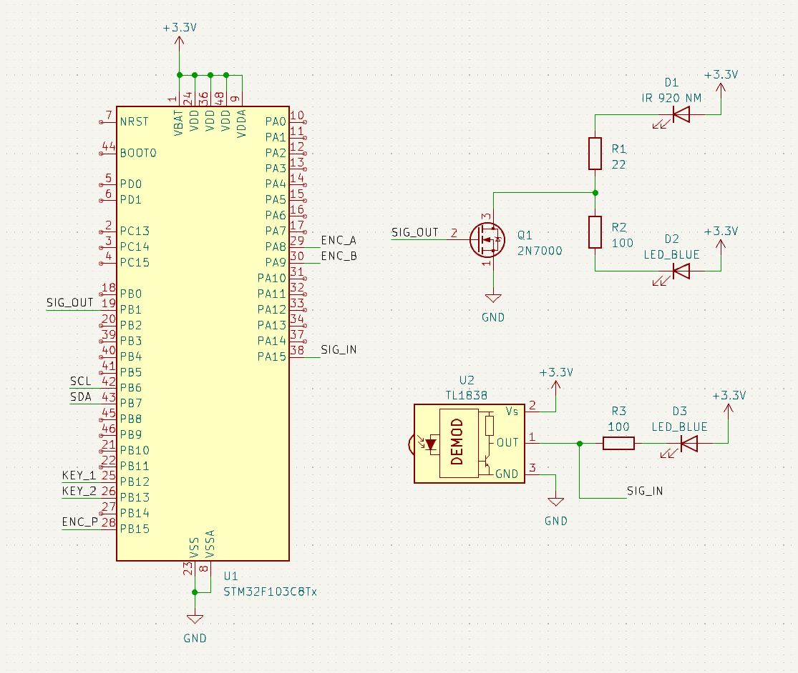

# IR-Controller-AC-YBOF2

A STM32 driven auto On/Off controller for air conditioner.

The controller board of air conditioner in my room was damaged by a lightning strike, while the manufacturer cannot provide spare parts because it is a pretty old model. Therefore, an external IR controller module was hacked onto the system to make it run. However, it only provides the functionally of tunning the AC On/Off, nothing else, no mode switching, no temperature sensing, no power adjusting. If you just leave it on, the room temperature will drop from 40 degrees celsius to 15 degrees celsius uncontrollably. That is why I made this silly thing to fix it.

|  |  |
| ------------------------------- | ------------------------------- |

## Features

- Turn AC On/Off via YBOF2's IR protocol
- Set and auto-maintain a temperature range by turing AC On and Off
- Based on BaudDance's STM32 learning board

## Usage

- rotate encoder to adjust central temperature
- push and rotate encoder to adjust temperature range
- press key 1 to manually turn off the AC
- press key 2 to manually turn on the AC

## Display

- L: Lower boundary of the temperature
- U: Upper boundary of the temperature
- T: Current temperature
- H: Current humidity
- L: Last command sent (On/Off)
- D: Milliseconds left till next auto command available (prevent over-frequent controlling)
- C: Last detected command data (debugging)

## BOM

| Component                                     | Model              | Count | Comments      |
| --------------------------------------------- | ------------------ | ----- | ------------- |
| MCU                                           | STM32F103C8T6      | 1     | Onboard       |
| Key Switch                                    | Any                | 2     | Onboard       |
| Pushable Encoder                              | EC11 series        | 1     | Onboard       |
| OLED Screen (128 x 64) driven by CH1116 (I2C) | ZJY130-2864KSWLG01 | 1     | Onboard       |
| Temperature and Humidity sensor (I2C)         | AHT20              | 1     | Onboard       |
| N-Channel MOSFET                              | 2N7000             | 1     |               |
| Infrared LED                                  | 920 NM             | 1     |               |
| Infrared Receiver                             | TL1838             | 1     |               |
| Resistor                                      | 22 ohm             | 1     |               |
| Resistor                                      | 100 ohm            | 2     |               |
| LED                                           | Any Color          | 2     | I/O Indicator |

## Schematic

